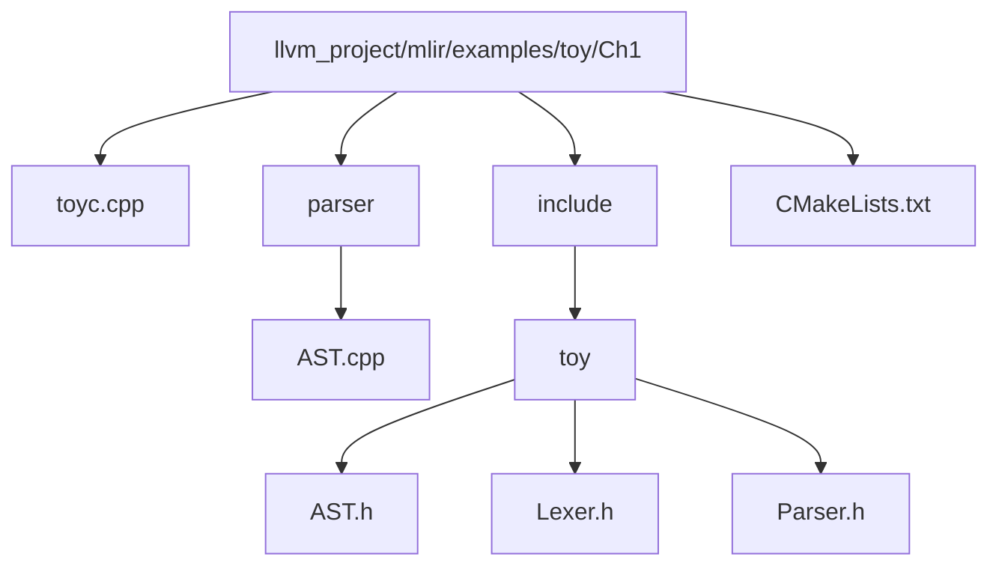
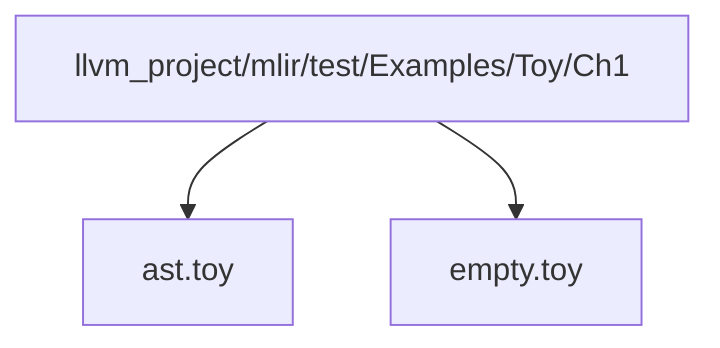

# Chapter 1 - Toy language to its AST

The Toy language is a very simple language with a few mathematical functionalities and a syntax which is a mixture of python and c++.

## File Structure of Ch1 compiler



**toyc.cpp -** The entry point for the compiler. Takes the file as input and calls the function to dump the AST present in the AST.h file. 
**AST.h -** Calls the Lexer.h and Parser.h files to convert the source code into the AST.
**AST.cpp -** Contains the code for the AST.h file.
**Lexer.h -** Converts the source code into tokens.
**Parser.h -** Uses the Recursive Descent Parser to create the AST.

#### Code instance of the toy language 

```bash
# User defined generic function that operates on unknown shaped arguments.
def multiply_transpose(a, b) {
  return transpose(a) * transpose(b);
}

def main() {
  # Define a variable `a` with shape <2, 3>, initialized with the literal value.
  var a = [[1, 2, 3], [4, 5, 6]];
  var b<2, 3> = [1, 2, 3, 4, 5, 6];

  # This call will specialize `multiply_transpose` with <2, 3> for both
  # arguments and deduce a return type of <3, 2> in initialization of `c`.
  var c = multiply_transpose(a, b);

  # A second call to `multiply_transpose` with <2, 3> for both arguments will
  # reuse the previously specialized and inferred version and return <3, 2>.
  var d = multiply_transpose(b, a);

  # A new call with <3, 2> (instead of <2, 3>) for both dimensions will
  # trigger another specialization of `multiply_transpose`.
  var e = multiply_transpose(c, d);

  # Finally, calling into `multiply_transpose` with incompatible shapes
  # (<2, 3> and <3, 2>) will trigger a shape inference error.
  var f = multiply_transpose(a, c);
}
```

#### This code snippet is  provided in the ast.toy file 



#### The source code in the ast.toy file is converted into its AST using the given command 

```bash
<path_to_toyc-ch1> <path_to_ast.toy> -emit=ast
```

#### The AST looks like this

```bash
Module:
  Function 
    Proto 'multiply_transpose' @test/Examples/Toy/Ch1/ast.toy:4:1
    Params: [a, b]
    Block {
      Return
        BinOp: * @test/Examples/Toy/Ch1/ast.toy:5:25
          Call 'transpose' [ @test/Examples/Toy/Ch1/ast.toy:5:10
            var: a @test/Examples/Toy/Ch1/ast.toy:5:20
          ]
          Call 'transpose' [ @test/Examples/Toy/Ch1/ast.toy:5:25
            var: b @test/Examples/Toy/Ch1/ast.toy:5:35
          ]
    } // Block
  Function 
    Proto 'main' @test/Examples/Toy/Ch1/ast.toy:8:1
    Params: []
    Block {
      VarDecl a<> @test/Examples/Toy/Ch1/ast.toy:11:3
        Literal: <2, 3>[ <3>[ 1.000000e+00, 2.000000e+00, 3.000000e+00], <3>[ 4.000000e+00, 5.000000e+00, 6.000000e+00]] @test/Examples/Toy/Ch1/ast.toy:11:11
      VarDecl b<2, 3> @test/Examples/Toy/Ch1/ast.toy:15:3
        Literal: <6>[ 1.000000e+00, 2.000000e+00, 3.000000e+00, 4.000000e+00, 5.000000e+00, 6.000000e+00] @test/Examples/Toy/Ch1/ast.toy:15:17
      VarDecl c<> @test/Examples/Toy/Ch1/ast.toy:19:3
        Call 'multiply_transpose' [ @test/Examples/Toy/Ch1/ast.toy:19:11
          var: a @test/Examples/Toy/Ch1/ast.toy:19:30
          var: b @test/Examples/Toy/Ch1/ast.toy:19:33
        ]
      VarDecl d<> @test/Examples/Toy/Ch1/ast.toy:22:3
        Call 'multiply_transpose' [ @test/Examples/Toy/Ch1/ast.toy:22:11
          var: b @test/Examples/Toy/Ch1/ast.toy:22:30
          var: a @test/Examples/Toy/Ch1/ast.toy:22:33
        ]
      VarDecl e<> @test/Examples/Toy/Ch1/ast.toy:25:3
        Call 'multiply_transpose' [ @test/Examples/Toy/Ch1/ast.toy:25:11
          var: c @test/Examples/Toy/Ch1/ast.toy:25:30
          var: d @test/Examples/Toy/Ch1/ast.toy:25:33
        ]
      VarDecl f<> @test/Examples/Toy/Ch1/ast.toy:28:3
        Call 'multiply_transpose' [ @test/Examples/Toy/Ch1/ast.toy:28:11
          var: a @test/Examples/Toy/Ch1/ast.toy:28:30
          var: c @test/Examples/Toy/Ch1/ast.toy:28:33
        ]
    } // Block
```
