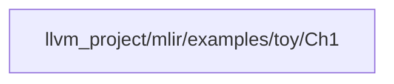

# Chapter 1 - Toy language to its AST

The Toy language is a very simple language with a few mathematical functionalities and a syntax which is a mixture of python and c++.

## File Structure of Ch1 compiler

