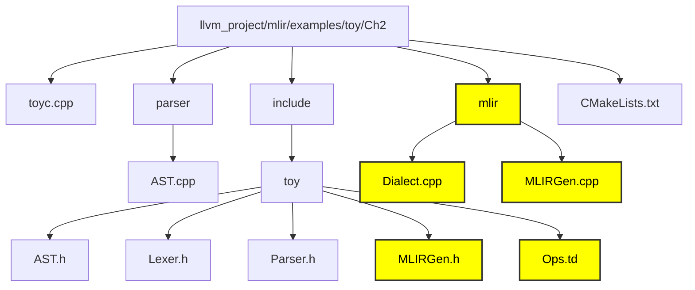

# Chapter 1 - AST to MLIR

In order to emit MLIR we need to define our toy dialect. A dialect is basically a namespace in the repo with a list of operations inside it. In the dialect we need to define the operations into which the high level language will get converted into. 

### Disclaimer - No need to write code its already written. Just run the commands to observe the output. 

## File Structure of Ch2 compiler



**mlir -** This repo contains the necessary files to generate mlir.

**Dialect.cpp -** This is where we define the language and write the logic for the operations in c++. 

**Ops.td -** In this tablegen file we have define the dialect and define the operations declaratively. The real use of the tablegen files is to generate include files.

**MLIRGen.cpp -** Contains source code for converting the AST to MLIR.

**MLIRGen.h -** Header file for MLIRGen.cpp.

#### Defining a dialect

To interface with MLIR, the new dialect will model the structure of the toy language and make it easy for high level analysis and transformations. 

##### Defining with Tablegen

The Ops.td file contains the following code already but we'll have to write it while making our own compilers.

```bash
// Provide a definition of the 'toy' dialect in the ODS framework so that we
// can define our operations.
def Toy_Dialect : Dialect {
  // The namespace of our dialect, this corresponds 1-1 with the string we
  // provided in `ToyDialect::getDialectNamespace`.
  let name = "toy";

  // A short one-line summary of our dialect.
  let summary = "A high-level dialect for analyzing and optimizing the "
                "Toy language";

  // A much longer description of our dialect.
  let description = [{
    The Toy language is a tensor-based language that allows you to define
    functions, perform some math computation, and print results. This dialect
    provides a representation of the language that is amenable to analysis and
    optimization.
  }];

  // The C++ namespace that the dialect class definition resides in.
  let cppNamespace = "toy";
}
```

##### The mlir-tblgen command generates include files for the dialect with the above code. 

```bash
<path_to_mlir_tblgen> -gen-dialect-decls <path_to_Ops.td> -I <mlir/include>
```

#### This generates the Dialect.cpp.inc file among other include files which contains the c++ declaration of the dialect.

```bash
/// This is the definition of the Toy dialect. A dialect inherits from
/// mlir::Dialect and registers custom attributes, operations, and types. It can
/// also override virtual methods to change some general behavior, which will be
/// demonstrated in later chapters of the tutorial.
class ToyDialect : public mlir::Dialect {
public:
  explicit ToyDialect(mlir::MLIRContext *ctx);

  /// Provide a utility accessor to the dialect namespace.
  static llvm::StringRef getDialectNamespace() { return "toy"; }

  /// An initializer called from the constructor of ToyDialect that is used to
  /// register attributes, operations, types, and more within the Toy dialect.
  void initialize();
};
```


#### The Dialect.cpp.inc file can be found in the given directory

```mermaid
graph LR
  llvm_project["llvm_project"]
  build["build"]

  llvm_project --> build

  build_tools["tools"]

  build --> build_tools

  tools_mlir["mlir"]
  tools_mlir_examples["examples"]
  tools_mlir_examples_toy["toy"]
  tools_mlir_examples_toy_ChX["ChX"]
  tools_mlir_examples_toy_ChX_include["include"]
  tools_mlir_examples_toy_ChX_include_toy["toy"]

  Dialect.cpp.inc["Dialect.cpp.inc"]
  Dialect.cpp.inc.d["Dialect.cpp.inc.d"]
  Dialect.h.inc["Dialect.h.inc"]
  Dialect.h.inc.d["Dialect.h.inc.d"]
  Opps.cpp.inc["Ops.cpp.inc"]
  Opps.cpp.inc.d["Ops.cpp.inc.d"]
  Opps.h.inc["Ops.h.inc"]
  Opps.h.inc.d["Ops.h.inc.d"]

  build_tools --> tools_mlir
  tools_mlir --> tools_mlir_examples
  tools_mlir_examples --> tools_mlir_examples_toy
  tools_mlir_examples_toy --> tools_mlir_examples_toy_ChX
  tools_mlir_examples_toy_ChX --> tools_mlir_examples_toy_ChX_include
  tools_mlir_examples_toy_ChX_include --> tools_mlir_examples_toy_ChX_include_toy

  tools_mlir_examples_toy_ChX_include_toy --> Dialect.cpp.inc
  tools_mlir_examples_toy_ChX_include_toy --> Dialect.cpp.inc.d
  tools_mlir_examples_toy_ChX_include_toy --> Dialect.h.inc
  tools_mlir_examples_toy_ChX_include_toy --> Dialect.h.inc.d
  tools_mlir_examples_toy_ChX_include_toy --> Opps.cpp.inc
  tools_mlir_examples_toy_ChX_include_toy --> Opps.cpp.inc.d
  tools_mlir_examples_toy_ChX_include_toy --> Opps.h.inc.d
  tools_mlir_examples_toy_ChX_include_toy --> Opps.h.inc.d

  classDef yellow fill:#ff0,stroke:#333,stroke-width:2px,color:#000;

  class Dialect.h.inc yellow 
  class Dialect.h.inc.d yellow
  class Dialect.cpp.inc yellow
  class Dialect.cpp.inc.d yellow
  class Opps.h.inc yellow
  class Opps.h.inc.d yellow
  class Opps.cpp.inc yellow
  class Opps.cpp.inc.d yellow
```

#### The AST looks like this

```bash
Module:
  Function 
    Proto 'multiply_transpose' @test/Examples/Toy/Ch1/ast.toy:4:1
    Params: [a, b]
    Block {
      Return
        BinOp: * @test/Examples/Toy/Ch1/ast.toy:5:25
          Call 'transpose' [ @test/Examples/Toy/Ch1/ast.toy:5:10
            var: a @test/Examples/Toy/Ch1/ast.toy:5:20
          ]
          Call 'transpose' [ @test/Examples/Toy/Ch1/ast.toy:5:25
            var: b @test/Examples/Toy/Ch1/ast.toy:5:35
          ]
    } // Block
  Function 
    Proto 'main' @test/Examples/Toy/Ch1/ast.toy:8:1
    Params: []
    Block {
      VarDecl a<> @test/Examples/Toy/Ch1/ast.toy:11:3
        Literal: <2, 3>[ <3>[ 1.000000e+00, 2.000000e+00, 3.000000e+00], <3>[ 4.000000e+00, 5.000000e+00, 6.000000e+00]] @test/Examples/Toy/Ch1/ast.toy:11:11
      VarDecl b<2, 3> @test/Examples/Toy/Ch1/ast.toy:15:3
        Literal: <6>[ 1.000000e+00, 2.000000e+00, 3.000000e+00, 4.000000e+00, 5.000000e+00, 6.000000e+00] @test/Examples/Toy/Ch1/ast.toy:15:17
      VarDecl c<> @test/Examples/Toy/Ch1/ast.toy:19:3
        Call 'multiply_transpose' [ @test/Examples/Toy/Ch1/ast.toy:19:11
          var: a @test/Examples/Toy/Ch1/ast.toy:19:30
          var: b @test/Examples/Toy/Ch1/ast.toy:19:33
        ]
      VarDecl d<> @test/Examples/Toy/Ch1/ast.toy:22:3
        Call 'multiply_transpose' [ @test/Examples/Toy/Ch1/ast.toy:22:11
          var: b @test/Examples/Toy/Ch1/ast.toy:22:30
          var: a @test/Examples/Toy/Ch1/ast.toy:22:33
        ]
      VarDecl e<> @test/Examples/Toy/Ch1/ast.toy:25:3
        Call 'multiply_transpose' [ @test/Examples/Toy/Ch1/ast.toy:25:11
          var: c @test/Examples/Toy/Ch1/ast.toy:25:30
          var: d @test/Examples/Toy/Ch1/ast.toy:25:33
        ]
      VarDecl f<> @test/Examples/Toy/Ch1/ast.toy:28:3
        Call 'multiply_transpose' [ @test/Examples/Toy/Ch1/ast.toy:28:11
          var: a @test/Examples/Toy/Ch1/ast.toy:28:30
          var: c @test/Examples/Toy/Ch1/ast.toy:28:33
        ]
    } // Block
```
The next chapter demonstrates how to convert the AST to MLIR.
