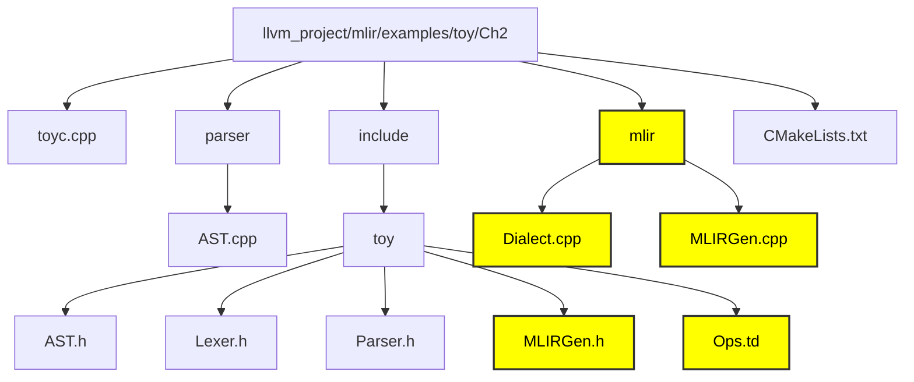
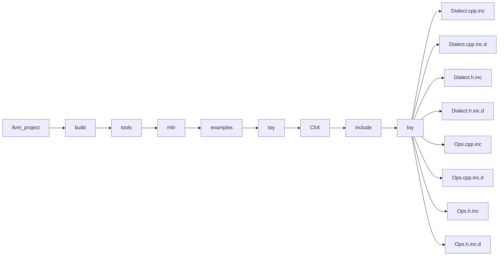

# Chapter 2 - AST to MLIR

In order to emit MLIR we need to define our toy dialect. A dialect is basically a namespace in the repo with a list of operations inside it. In the dialect we need to define the operations into which the high level language will get converted into. 

### Disclaimer - No need to write code its already written. Just run the commands to observe the output. 

## File Structure of Ch2 compiler



**mlir -** This repo contains the necessary files to generate mlir.

**Dialect.cpp -** This is where we define the language and write the logic for the operations in c++. 

**Ops.td -** In this tablegen file we have define the dialect and define the operations declaratively. The real use of the tablegen files is to generate include files.

**MLIRGen.cpp -** Contains source code for converting the AST to MLIR.

**MLIRGen.h -** Header file for MLIRGen.cpp.

#### Defining a dialect

To interface with MLIR, the new dialect will model the structure of the toy language and make it easy for high level analysis and transformations. 

##### Defining with Tablegen

The Ops.td file contains the following code already but we'll have to write it while making our own compilers.

```bash
// Provide a definition of the 'toy' dialect in the ODS framework so that we
// can define our operations.
def Toy_Dialect : Dialect {
  // The namespace of our dialect, this corresponds 1-1 with the string we
  // provided in `ToyDialect::getDialectNamespace`.
  let name = "toy";

  // A short one-line summary of our dialect.
  let summary = "A high-level dialect for analyzing and optimizing the "
                "Toy language";

  // A much longer description of our dialect.
  let description = [{
    The Toy language is a tensor-based language that allows you to define
    functions, perform some math computation, and print results. This dialect
    provides a representation of the language that is amenable to analysis and
    optimization.
  }];

  // The C++ namespace that the dialect class definition resides in.
  let cppNamespace = "toy";
}
```

##### The mlir-tblgen command generates declaration in the include files for the dialect with the above code. 

```bash
<path_to_mlir_tblgen> -gen-dialect-decls <path_to_Ops.td> -I <mlir/include>
```

#### This generates the Dialect.cpp.inc file among other include files which contains the c++ declaration of the dialect.

```bash
/// This is the definition of the Toy dialect. A dialect inherits from
/// mlir::Dialect and registers custom attributes, operations, and types. It can
/// also override virtual methods to change some general behavior, which will be
/// demonstrated in later chapters of the tutorial.
class ToyDialect : public mlir::Dialect {
public:
  explicit ToyDialect(mlir::MLIRContext *ctx);

  /// Provide a utility accessor to the dialect namespace.
  static llvm::StringRef getDialectNamespace() { return "toy"; }

  /// An initializer called from the constructor of ToyDialect that is used to
  /// register attributes, operations, types, and more within the Toy dialect.
  void initialize();
};
```


#### The Dialect.cpp.inc and other include files can be found in the given directory



#### Defining Operations in the dialect

Operations have to be defined in the Ops.td file and the Dialect.cpp file. The Dialect.cpp file will contain the code and logic of the operation and the Ops.td will contain the declaration which will generate the include files. 

##### Subtraction function for Ops.td

```bash
def SubOp : Toy_Op<"sub"> {
  let summary = "element-wise subtraction operation";
  let description = [{
    The "sub" operation performs element-wise subtraction between two tensors.
    The shapes of the tensor operands are expected to match.
  }];

  let arguments = (ins F64Tensor:$lhs, F64Tensor:$rhs);
  let results = (outs F64Tensor);

  // Indicate that the operation has a custom parser and printer method.
  // let hasCustomAssemblyFormat = 1;

  // Allow building an AddOp with from the two input operands.
  let builders = [
    OpBuilder<(ins "Value":$lhs, "Value":$rhs)>
  ];
}
```

##### Subtraction function for Dialect.cpp

```bash
void SubOp::build(mlir::OpBuilder &builder, mlir::OperationState &state,
                  mlir::Value lhs, mlir::Value rhs) {
  state.addTypes(UnrankedTensorType::get(builder.getF64Type()));
  state.addOperands({lhs, rhs});
}

mlir::ParseResult SubOp::parse(mlir::OpAsmParser &parser,
                               mlir::OperationState &result) {
  return parseBinaryOp(parser, result);
}

void SubOp::print(mlir::OpAsmPrinter &p) { printBinaryOp(p, *this); }
```

You can add as many operations as you want in the dialect. 

##### The mlir-tblgen command generates declaration in the include files for the operations with the above code. 

```bash
<path_to_mlir_tblgen> -gen-op-decls <path_to_Ops.td> -I <mlir/include>
```

#### After creating the dialect and its operations we can lower the AST to MLIR.

```bash
# User defined generic function that operates on unknown shaped arguments.
def multiply_transpose(a, b) {
  return transpose(a) * transpose(b);
}

def main() {
  var a<2, 3> = [[1, 2, 3], [4, 5, 6]];
  var b<2, 3> = [1, 2, 3, 4, 5, 6];
  var c = multiply_transpose(a, b);
  var d = multiply_transpose(b, a);
  print(d);
}
```

##### This high level code is provided in codegen.toy and is converted to MLIR using the following command

```bash
<path_to_toyc-ch2> <path_to_codegen.toy> -emit=mlir -mlir-print-debuginfo>
```

#### The MLIR representation looks like this

```bash
module {
  "toy.func"() ({
  ^bb0(%arg0: tensor<*xf64> loc("test/Examples/Toy/Ch2/codegen.toy":4:1), %arg1: tensor<*xf64> loc("test/Examples/Toy/Ch2/codegen.toy":4:1)):
    %0 = "toy.transpose"(%arg0) : (tensor<*xf64>) -> tensor<*xf64> loc("test/Examples/Toy/Ch2/codegen.toy":5:10)
    %1 = "toy.transpose"(%arg1) : (tensor<*xf64>) -> tensor<*xf64> loc("test/Examples/Toy/Ch2/codegen.toy":5:25)
    %2 = "toy.mul"(%0, %1) : (tensor<*xf64>, tensor<*xf64>) -> tensor<*xf64> loc("test/Examples/Toy/Ch2/codegen.toy":5:25)
    "toy.return"(%2) : (tensor<*xf64>) -> () loc("test/Examples/Toy/Ch2/codegen.toy":5:3)
  }) {sym_name = "multiply_transpose", type = (tensor<*xf64>, tensor<*xf64>) -> tensor<*xf64>} : () -> () loc("test/Examples/Toy/Ch2/codegen.toy":4:1)
  "toy.func"() ({
    %0 = "toy.constant"() {value = dense<[[1.000000e+00, 2.000000e+00, 3.000000e+00], [4.000000e+00, 5.000000e+00, 6.000000e+00]]> : tensor<2x3xf64>} : () -> tensor<2x3xf64> loc("test/Examples/Toy/Ch2/codegen.toy":9:17)
    %1 = "toy.reshape"(%0) : (tensor<2x3xf64>) -> tensor<2x3xf64> loc("test/Examples/Toy/Ch2/codegen.toy":9:3)
    %2 = "toy.constant"() {value = dense<[1.000000e+00, 2.000000e+00, 3.000000e+00, 4.000000e+00, 5.000000e+00, 6.000000e+00]> : tensor<6xf64>} : () -> tensor<6xf64> loc("test/Examples/Toy/Ch2/codegen.toy":10:17)
    %3 = "toy.reshape"(%2) : (tensor<6xf64>) -> tensor<2x3xf64> loc("test/Examples/Toy/Ch2/codegen.toy":10:3)
    %4 = "toy.generic_call"(%1, %3) {callee = @multiply_transpose} : (tensor<2x3xf64>, tensor<2x3xf64>) -> tensor<*xf64> loc("test/Examples/Toy/Ch2/codegen.toy":11:11)
    %5 = "toy.generic_call"(%3, %1) {callee = @multiply_transpose} : (tensor<2x3xf64>, tensor<2x3xf64>) -> tensor<*xf64> loc("test/Examples/Toy/Ch2/codegen.toy":12:11)
    "toy.print"(%5) : (tensor<*xf64>) -> () loc("test/Examples/Toy/Ch2/codegen.toy":13:3)
    "toy.return"() : () -> () loc("test/Examples/Toy/Ch2/codegen.toy":8:1)
  }) {sym_name = "main", type = () -> ()} : () -> () loc("test/Examples/Toy/Ch2/codegen.toy":8:1)
} loc(unknown)
```

The next chapter deals with optimizing MLIR.
