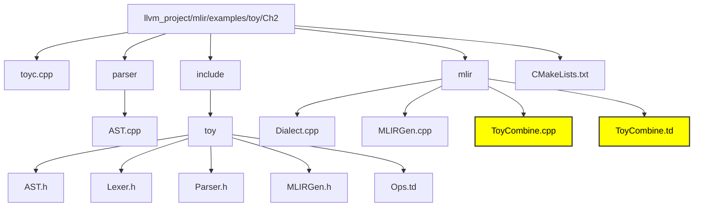

# Chapter 3 - MLIR to MLIR Optimized

This chapter deals optimizing MLIR. 

### Disclaimer - No need to write code its already written. Just run the commands to observe the output. 

## File Structure of Ch3 compiler



**ToyCombine.td -** This repo contains the necessary files to generate mlir.

**ToyCombine.cpp -** This is where we define the language and write the logic for the operations in c++. 

#### Local and Global Optimizations 

Global optimizations are done in the AST while local optimizations are done in using C++ style pattern rewrite and Tablgen style DRR (Declarative Rewrite). 

#### C++ Pattern Rewrite

For the given code which is present in transpose_transpose.toy

```bash
def transpose_transpose(x) {
  return transpose(transpose(x));
}
```

This is the MLIR

```bash
toy.func @transpose_transpose(%arg0: tensor<*xf64>) -> tensor<*xf64> {
  %0 = toy.transpose(%arg0 : tensor<*xf64>) to tensor<*xf64>
  %1 = toy.transpose(%0 : tensor<*xf64>) to tensor<*xf64>
  toy.return %1 : tensor<*xf64>
}
```

##### The mlir-tblgen command generates declaration in the include files for the dialect with the above code. 

```bash
<path_to_mlir_tblgen> -gen-dialect-decls <path_to_Ops.td> -I <mlir/include>
```

#### We can optimize this code with the help of the following rewrite which is present in ToyCombine.cpp

```bash
/// Fold transpose(transpose(x)) -> x
struct SimplifyRedundantTranspose : public mlir::OpRewritePattern<TransposeOp> {
  /// We register this pattern to match every toy.transpose in the IR.
  /// The "benefit" is used by the framework to order the patterns and process
  /// them in order of profitability.
  SimplifyRedundantTranspose(mlir::MLIRContext *context)
      : OpRewritePattern<TransposeOp>(context, /*benefit=*/1) {}

  /// This method is attempting to match a pattern and rewrite it. The rewriter
  /// argument is the orchestrator of the sequence of rewrites. It is expected
  /// to interact with it to perform any changes to the IR from here.
  llvm::LogicalResult
  matchAndRewrite(TransposeOp op,
                  mlir::PatternRewriter &rewriter) const override {
    // Look through the input of the current transpose.
    mlir::Value transposeInput = op.getOperand();
    TransposeOp transposeInputOp = transposeInput.getDefiningOp<TransposeOp>();

    // Input defined by another transpose? If not, no match.
    if (!transposeInputOp)
      return failure();

    // Otherwise, we have a redundant transpose. Use the rewriter.
    rewriter.replaceOp(op, {transposeInputOp.getOperand()});
    return success();
  }
};
```

#### In order for this change to take place we register this with the Canonicalization framework

```bash
// Register our patterns for rewrite by the Canonicalization framework.
void TransposeOp::getCanonicalizationPatterns(
    RewritePatternSet &results, MLIRContext *context) {
  results.add<SimplifyRedundantTranspose>(context);
}
```
#### This optimization is then run through the PassManager in toyc.cpp

```bash
mlir::PassManager pm(module->getName());
pm.addNestedPass<mlir::toy::FuncOp>(mlir::createCanonicalizerPass());
```

#### Compile this with toyc-ch3 

```bash
<path_to_toyc-ch3> <path_to_transpose_transpose.toy> -emit=mlir -opt
```
#### Gives the following output

```bash
toy.func @transpose_transpose(%arg0: tensor<*xf64>) -> tensor<*xf64> {
  %0 = toy.transpose(%arg0 : tensor<*xf64>) to tensor<*xf64>
  toy.return %arg0 : tensor<*xf64>
}
```

#### There is still one dead transpose left, which can be eliminated by adding "[Pure]" to the operation definition in Ops.td. The "[Pure]" keyword removes all side effects.

```bash
def TransposeOp : Toy_Op<"transpose", [Pure]> {...}
```

#### Running the above command again gives us

```bash
toy.func @transpose_transpose(%arg0: tensor<*xf64>) -> tensor<*xf64> {
  toy.return %arg0 : tensor<*xf64>
}
```

### Optimizing reshapes using DRR

This method is used to define a pattern of rewrite and apply it everywhere in the code.

#### This code defines a dag based rewriter, in the ToyCombine.td file.

```bash
class Pattern<
    dag sourcePattern, list<dag> resultPatterns,
    list<dag> additionalConstraints = [],
    dag benefitsAdded = (addBenefit 0)>;
```

#### The following code defines the function that optimizes reshape

```bash
// Reshape(Reshape(x)) = Reshape(x)
def ReshapeReshapeOptPattern : Pat<(ReshapeOp(ReshapeOp $arg)),
                                   (ReshapeOp $arg)>;
```

#### After building this files the C++ declarations can be found in the ToyCombine.inc file. 

```bash
llvm_project/build/tools/mlir/examples/toy/Ch3/ToyCombine.inc
```

#### If the reshape function gets the required shaped input then there is no need to reshape it. 

 ```bash
def TypesAreIdentical : Constraint<CPred<"$0.getType() == $1.getType()">>;
def RedundantReshapeOptPattern : Pat<
  (ReshapeOp:$res $arg), (replaceWithValue $arg),
  [(TypesAreIdentical $res, $arg)]>;
```

#### Hence for the given Toy code

```bash
def main() {
  var a<2,1> = [1, 2];
  var b<2,1> = a;
  var c<2,1> = b;
  print(c);
}
```

#### This is the expected output

```bash
module {
  toy.func @main() {
    %0 = toy.constant dense<[1.000000e+00, 2.000000e+00]> : tensor<2xf64>
    %1 = toy.reshape(%0 : tensor<2xf64>) to tensor<2x1xf64>
    %2 = toy.reshape(%1 : tensor<2x1xf64>) to tensor<2x1xf64>
    %3 = toy.reshape(%2 : tensor<2x1xf64>) to tensor<2x1xf64>
    toy.print %3 : tensor<2x1xf64>
    toy.return
  }
}
```

#### The following command gives the optimized output

```bash
<path_to_toyc-ch3> <path_to_trivial_reshape.toy> -emit=mlir -opt
```

#### Optimized MLIR

```bash
module {
  toy.func @main() {
    %0 = toy.constant dense<[[1.000000e+00], [2.000000e+00]]> : tensor<2x1xf64>
    toy.print %0 : tensor<2x1xf64>
    toy.return
  }
}
```

The next chapter deals with enalbing generic transformations.
