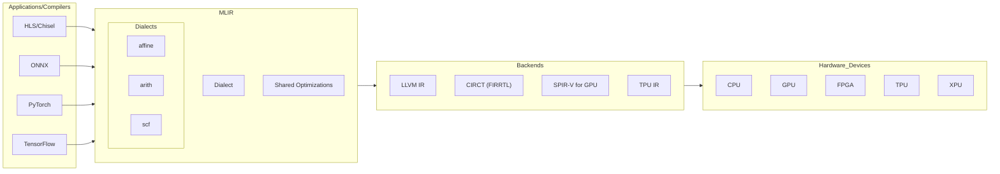

# MLIR for Dummies

### What is MLIR?
MLIR (Multi-Level Intermediate Representation) is a framework in the LLVM project that helps in creating and optimizing compilers. It enables the use of several intermediate representations at various levels, making it easier to implement domain specific optimizations and hence create Domain Specific Compilers. 

It can be used to create compiler frontends as well as backends.

