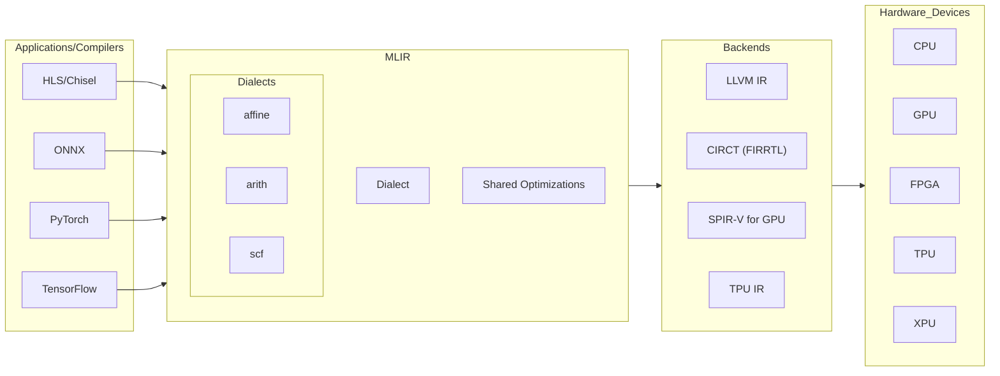
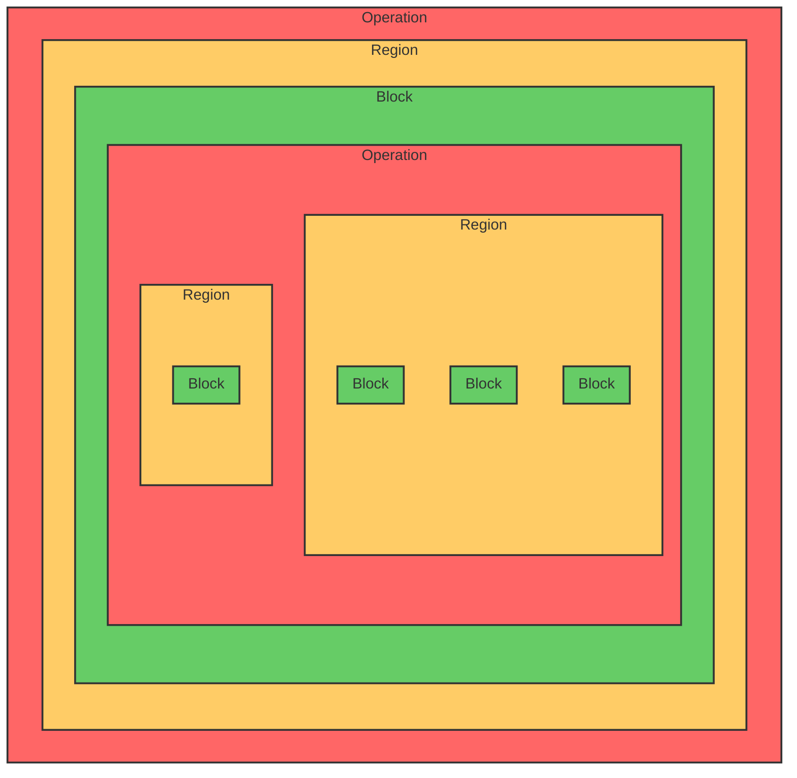

# MLIR for Beginners

### What is MLIR?
MLIR (Multi-Level Intermediate Representation) is a framework in the LLVM project that helps in creating and optimizing compilers. It enables the use of several intermediate representations at various levels, making it easier to implement domain specific optimizations and hence create Domain Specific Compilers. 

It can be used to create compiler frontends as well as backends.



### What makes MLIR special?

#### Multilevel IR
Most compilers convert high-level programming languages into an Intermediate Representation (IR), like LLVM IR. However, this process often misses out on domain-specific optimizations and can make custom optimizations challenging. MLIR (Multi-Level Intermediate Representation) addresses this by offering multiple levels of IR. It gradually translates high-level code down through these levels, allowing for domain-specific and high-level optimizations at each stage. This results in a more optimized and efficient IR tailored to specific needs.

But this concept isn't new and can be implemented with any tool or language and not just MLIR. 

#### Same syntax for defining all dialects
MLIR lower languages in the form of dialects(which is basically another language or IR) which consists of operations where you can define your own operations. All these dialects have the same syntax, which makes writing multiple dialects super easy. This is what makes MLIR really powerful.

##### Tensorflow
```bash
%x = "tf.Conv2d"(%input, %filter)
   {strides: [1,1,2,1], padding: "SAME", dilations: [2,1,1,1]}
   : (tensor<*xf32>, tensor<*xf32>) -> tensor<*xf32>
```
##### XLA HLO
```bash
%m = "xla.AllToAll"(%z)
   {split_dimension: 1, concat_dimension: 0, split_count: 2}
   : (memref<300x200x32xf32>) -> memref<600x100x32xf32>
```
##### LLVM IR
```bash
%f = llvm.add %a, %b
   : !llvm.float
```
### Operation Structure

All dialects, which are just a collection of operations are written in the following syntax. 

```bash
%res:2 = "mydialect.morph"(%input#3) { some_attribute = true, other_attribute = 1.5 } \
       : (!mydialect<"custom_type">) -> (!mydialect<"other_type">, !mydialect<"other_type">) \
       loc(callsite("foo" at "mysource.cc":10:8))

# %res:2                  : Name of the result (2 values returned)
# "mydialect.morph"       : Op Id (mydialect is dialect prefix, morph is operation name)
# (%input#3)              : Argument to the operation
# { ... }                 : List of attributes (constant named arguments)
# (!mydialect<"custom_type">) : Input type specification
# -> (... , ...)          : Output type specification (two output types)
# loc(...)                : Location information (source file and position)
```
### IR Structure

